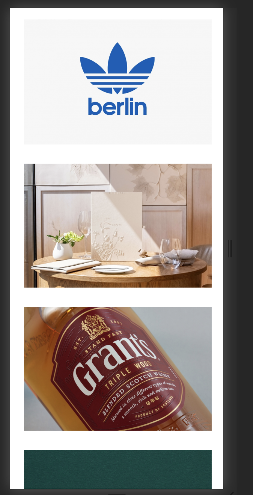
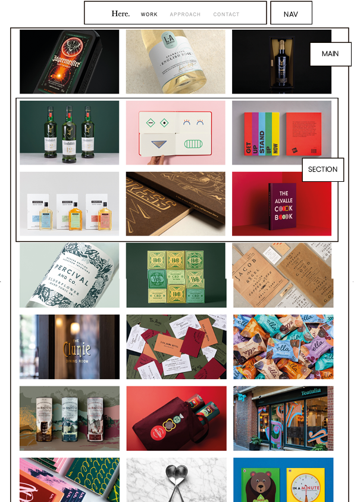

# Procesverslag
**Auteur:** -Carolinie Subramamiam -

Markdown cheat cheet: [Hulp bij het schrijven van Markdown](https://github.com/adam-p/markdown-here/wiki/Markdown-Cheatsheet). Nb. de standaardstructuur en de spartaanse opmaak zijn helemaal prima. Het gaat om de inhoud van je procesverslag. Besteedt de tijd voor pracht en praal aan je website.

https://caroliniesubramaniam.github.io/Fronted-development/

## Bronnenlijst
1. -bron 1-
2. -bron 2-
3. -...-

## Eindgesprek (week 7/8)

-dit ging goed & dit was lastig-

**Screenshot(s):**

-screenshot(s) van je eindresultaat-

## Voortgang 3 (week 6)

-same as voortgang 1-

## Voortgang 2 (week 5)

-same as voortgang 1-

## Voortgang 1 (week 3)

### Stand van zaken

Ik vind het nog moeilijk om een hamburger menu te maken, ik heb verschillende tutorials bekeken maar ik kom er nog niet helemaal uit. Verder ben ik al een beetje begonnen met de 'gallerij' alleen loop ik vast, want ik krijg mijn images niet in het midden van de pagina. 

**Screenshot(s):**

 

 

 

### Agenda voor meeting

Geen agenda gemaakt

### Verslag van meeting

Tijdens de meeting hebben wij vragen gesteld, we hebben uitleg gekregen over de hamburger menu. Daarna heb ik nog hulp gekregen van de student assistente over de header, alleen kwamen we er beide niet uit en moest ik weer terug komen als mijn website live stond. 

## Intake (week 1)

**Je startniveau:** - blauw -

**Je focus:** -responsive -

**Je opdracht:** - https://www.heredesign.co.uk/ -

**Screenshot(s):**

 

**Breakdown-schets(en):**

