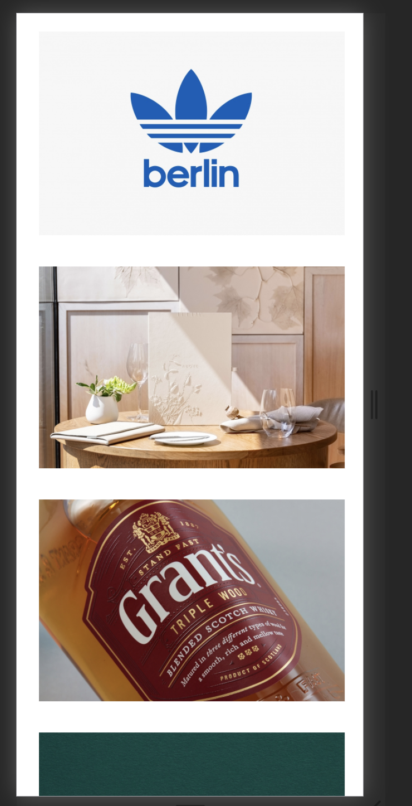
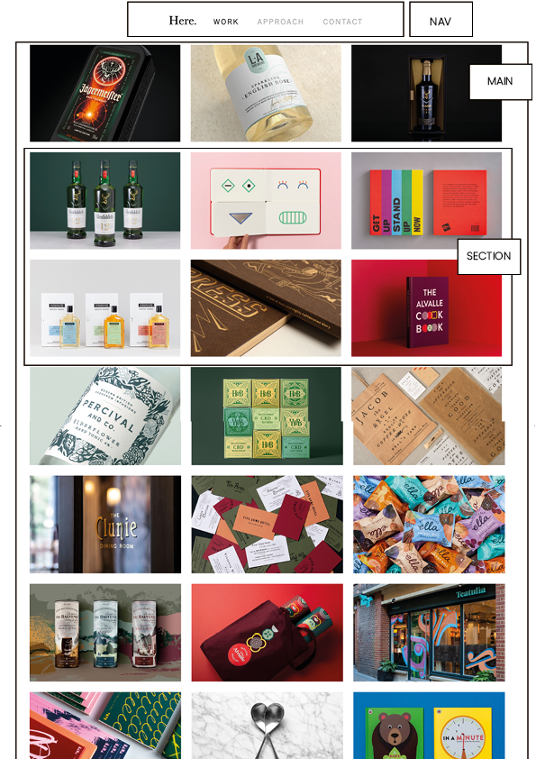

# Procesverslag
**Auteur:** -Carolinie Subramamiam -

Markdown cheat cheet: [Hulp bij het schrijven van Markdown](https://github.com/adam-p/markdown-here/wiki/Markdown-Cheatsheet). Nb. de standaardstructuur en de spartaanse opmaak zijn helemaal prima. Het gaat om de inhoud van je procesverslag. Besteedt de tijd voor pracht en praal aan je website.

https://caroliniesubramaniam.github.io/Fronted-development/

## Bronnenlijst
1. https://codepen.io/derekfletes/pen/MJeXeM
2. https://www.w3schools.com/css/css3_buttons.asp
3. https://www.heredesign.co.uk/
4. https://yoksel.github.io/flex-cheatsheet/#section-justify-content
5. https://www.youtube.com/watch?v=DZg6UfS5zYg

## Eindgesprek (week 7/8)

Ik heb mijn website afgemaakt. Ik heb de slider weggelaten omdat ik dit nog best vond in Javascript, verder heb ik derest van de content toegevoegd. Ik heb ook een animatie button gemaakt, als je erop klikt dan kom je in de darkmode versie van de website. 

**Screenshot(s):**

 

 

 

 

## Voortgang 3 (week 6)

### Stand van zaken

Ik ben verder gegaan met mijn code, ik ben nog bezig met mijn slider. Ik probeer de Javascript te begrijpen door steeds te kijken wat de code precies doet. Verder ben ik begonnen met de tweede pagina en maak ik daarin gebruik van Grid

## Voortgang 2 (week 5)

### Stand van zaken

Ik heb mijn code helemaal opnieuw gemaakt, er zat een fout in mijn code en die kreeg ik er maar niet uit dus ik ben opnieuw begonennen. Verder heb ik een hamburger menu alleen heb ik dit door verschillende tutorials gemaakt. Mijn gallerij staat eindelijk in het midden, alleen moet ik de juiste formule vinden voor de afbeeldingen om het responsive te maken. 

### Agenda voor meeting
- Grids
- Keyframes

**Screenshot(s):**

 

 

### Verslag van meeting

Tijdens de meeting hebben wij met de studentassistente gekeken naar onze websites. Hij heeft mij geholpen met de formule van mijn afbeeldingen. Dit was niet nodig ik had mijn height van de images aan staan, dit moest ik uitzetten. 

## Voortgang 1 (week 3)

### Stand van zaken

Ik vind het nog moeilijk om een hamburger menu te maken, ik heb verschillende tutorials bekeken maar ik kom er nog niet helemaal uit. Verder ben ik al een beetje begonnen met de 'gallerij' alleen loop ik vast, want ik krijg mijn images niet in het midden van de pagina. 

**Screenshot(s):**

 

 

 

### Agenda voor meeting

Geen agenda gemaakt

### Verslag van meeting

Tijdens de meeting hebben wij vragen gesteld, we hebben uitleg gekregen over de hamburger menu. Daarna heb ik nog hulp gekregen van de student assistente over de header, alleen kwamen we er beide niet uit en moest ik weer terug komen als mijn website live stond. 

## Intake (week 1)

**Je startniveau:** - blauw -

**Je focus:** -responsive -

**Je opdracht:** - https://www.heredesign.co.uk/ -

**Screenshot(s):**

 

**Breakdown-schets(en):**

